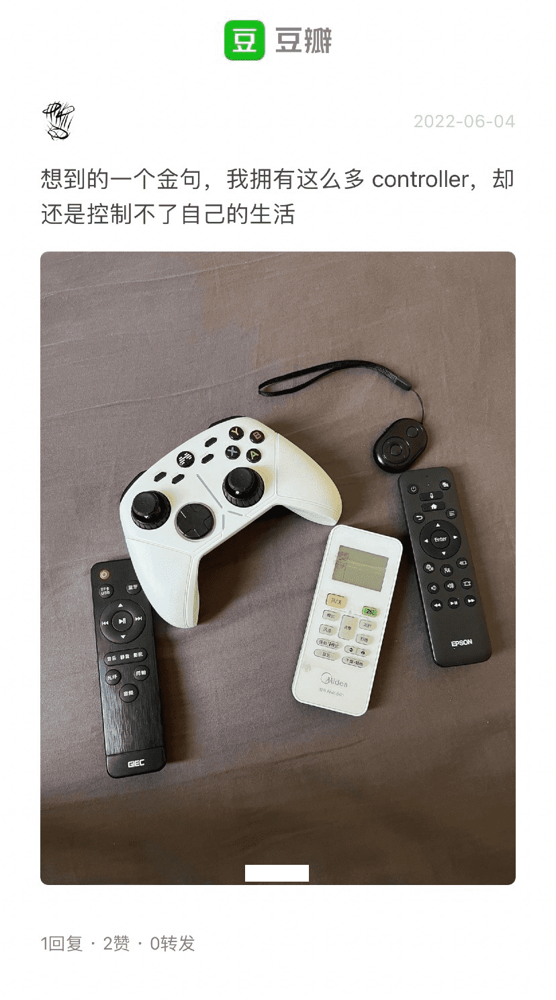
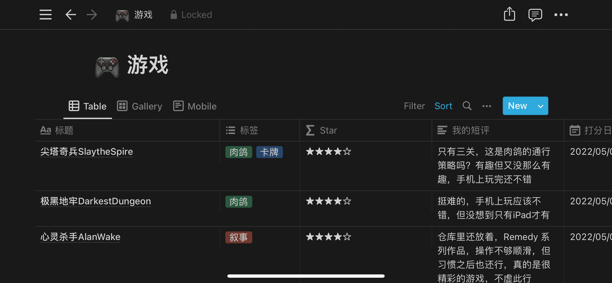

不知道是不是居家的原因，感觉五月的思考、想法似乎都比往日多一些。其实也可能每个月我都有那么多的想法，只是我没有把它们记下来而已，所以我再次恢复了记录。

在我看来，居家之后大家时间观念都变得混沌，工作时间显著变长，生活和工作的界限模糊不清，缺少必要的活动，所以我一点也不喜欢居家办公。

不过由于做饭机会多了，在家这段时间尝试制作了各种形式的面条。做饭期间我会下意识地开始追求并行工作，比如炒菜的时候煮面，收汁的时候清洗菜刀、菜板之类的，尽量提高的做饭的效率，所以谈不上厨艺增长，但确实变得熟练了。

## Fimarathon（电影马拉松）
我的五月是从电影马拉松开始的，感谢伙伴们的支持，这个活动居然已经办了两期，马拉松，顾名思义，就是一口气看很好几部电影。一个人沉浸在电影中，尤其是在电影院，体验真的极好，之前在小西天看了《大路》，从电影院走出来的时候，真的有一种恍若隔世的感觉。

但我也很喜欢在看电影的时候发出一些感叹和想法，尤其是我也很想确认面对某个情节时别人会如何看待，而我又如何看待，去对比两种看法之间的异同。而且在看《无人知晓》的时候，小男孩专门找一位便利店的姐姐拿钱还是怎么样，这个情节我其实并没有十分 get 到，还是朋友解释可能是请店员在红包封皮上写名字，感觉这也是大家一起看电影的好处，抓过那些模糊的情节。

我原本会觉得一天看五部电影不成问题，毕竟是电影马拉松，总要有一点耐力的感觉。但可能是电影片长的差异也比较大，还要纠结外卖吃什么，又会有片后交流和饭后闲聊。所以最后一天其实只能够看三部电影。之后再紧凑一点可能能看四部，但这应该真的是极限了。

**PS：** 有一个朋友告诉我他大学的时候，有人每周五都在学校门口放电影。想象一下，真的是非常的浪漫，除了或许会有蚊子？但似乎在露天环境吃烧烤似乎也不会被蚊子咬，但真的感觉很棒，搞一个小黑板放在旁边写上片名，自己就只管放自己的电影，看自己的电影，就好像在举办一个自己的 curated 影展，如果有可能，如果有机会，我也要在大学门口放电影。

## 历史
虽然我还是大量收听播客，但我还是不可避免地开始感到无聊，感到无法进入。或许是我的背景知识太浅、或许是他们的话题太发散。总之我开始寄希望于从博客中更多明确的信息、获得更多所谓的「干货」，已经不再像当年一样享受播客中的「湿货」。

所以我开始找一些有声书来听，五月初听完了 [《天朝的崩溃》-喜马拉雅](https://www.ximalaya.com/youshengshu/24537846/) ，然后又听完了 [《万历十五年》-哔哩哔哩](https://www.bilibili.com/video/BV1KL411E7pv) ，再加上电影马拉松的时候看了 [《末代皇帝》-哔哩哔哩](https://www.bilibili.com/bangumi/play/ep334037) ，在家没那么专心的时候，还看了 [《一口气看完，甄嬛传！》-哔哩哔哩](https://www.bilibili.com/video/BV1wL411K7iq) （消费速看内容这件事情让我有点点羞愧，毕竟速看就只是了解了情节而已，而作品自有的韵味、乐趣都失掉了……

这些历史题材的内容交织在一起之后，作为皇帝，如果是开国皇帝，那么他往往会基于前朝覆灭的原因，来对本朝的政治制度进行针对性的改造和优化，而改造和优化的目的也很简单——更长久、更稳定的统治，而实现方式往往就是增强自身的权力，限制非皇权能够使用的权力，这意味着皇帝拥有更多的权力，但其实也意味着皇帝要有更多的付出。但不管皇帝权力的多少，都不可能靠皇帝一个人去统治整个国家，所以不管是丞相、宰相还是首辅、军机处，皇帝都必须要依靠官员去实现他的统治，而他能做的、他不能做的事情其实完全依赖于他的官员们能做、不能做的。

对于后续承继大统的皇帝，除非是战乱动荡，否则大多数皇子都会经历一系列仁义道德的教育，他只能几乎没得选，只能在各方的推动下，去成为真龙天子、去成为道德楷模、去成为神化的人。这种情况他需要做的绝大多数事情都已经被决定了，如果是有能力的皇帝，可能会去想方设法挣脱束缚，但对于普通资质的皇帝来说，这件事情就变得非常吃力，文官集团的对皇帝提的要求很难被拒绝，皇帝想做的又都要得到百官的赞同。

《万历十五年》就是从这个角度讲了万历皇帝在张居正、申时行之后，对皇帝这个身份陷入的自我怀疑以及想要摆脱文官集团的希望驱使下，他开始摆烂，他想实施的政策大臣们反对，大臣想实施的政策他也不同意，在这种僵持之下，帝国的衰败已经无可避免。

《天朝的崩溃》这本书副标题是「鸦片战争再研究」，作者对第一次鸦片战争中的军备、防务、关键时间点和关键人物都进行了完整的介绍和分析。我们当然泛泛的明白第一次鸦片战争的时候，清朝的军备不如英军的，我们也大略知道清朝的腐朽和闭关锁国，但具体如何不如英国，英国派遣到中国的军队人数其实相当有限，英军真的是完全不可战胜的吗，中国有机会在鸦片战争中取胜吗，中国从鸦片战争得到了什么，这本书都给出了解答。

听完这本书之后的最大感想也是我的第二感想，皇帝的信息太滞后了，他每次都在基于过期的、满是偏差的信息做决策，这样的决策到达前线又要非常久的时间，一切都晚了。这可能是皇帝总揽大权的恶果，也就是所有的官员都无法完全独立的做战略方针和策略上的部署，一切都有赖于快马上奏皇帝，然后再接收皇帝的遥控指挥。

皇帝身居北京，却要遥控指挥广州、上海、泉州的战事，这听起来其实非常离谱，战局变化迅速，导致皇帝收到的报告常常前后不一、口径不一致，一次又一次的捷报之后，突然传出一个失守的消息，他到底该如何面对这些情报？又如何判断哪些信息可以相信、哪些信息加以摒弃？而且他还要极快地完成战略的制定，因为本来已经在路上耽搁很久了。
、
越是想控制权力，可能权力越是会失控，皇帝这种完全不可行的遥控指挥导致的结果只能是「欺骗」，鸦片战争期间的每一个钦差大臣都在欺骗皇帝，他们必须及时做决定，而决定又往往与皇帝的要求不同，谎只能越扯越大；同样《甄嬛传》中各个妃子同样也只能围着皇帝转，这也只导致了一个结果「欺骗」，妃子们在互相戕害的同时就在哄骗、瞒骗、欺骗皇帝。

所以皇帝，一方面就坚持扮演一个道德完人，但另一方面，他清楚的自己的局限性，只能任由心中焦虑和怀疑不断生长和蔓延。

## 华丽的垃圾
对我来说， [《东京罪恶》-ddrk](https://ddrk.me/tokyo-vice/) 初看起来，精美的摄影、文化背景和黑帮故事都非常吸引我，但是我在看完的时候，心中只有一种感觉，那就是「被欺骗」。其实这种感觉在 [《离职》-ddrk](https://ddrk.me/severance/) 也有，但后者的设定比较有惊喜，虽然我还是给了五星，但最大的问题都差不多，情节顺拐、节奏拖拉，而且明明故事一季就能完结，又东拉西扯，拖拖拉拉一季演完了发现故事才刚刚开始。这会让人在剧情的回味中，越发的不满，因为如果是全面的差，那样可能就不会打开，但明明它们请了那么多优秀的人才和很棒的演员，花了很多钱在细节、摄影、灯光和服化道上，为什么最后拍出来的东西却故弄玄虚，有种怒其不争感。

一个非常新的例子是星战衍生剧《欧比旺》，作为迪士尼为自己平台导流的作品，最近几部星战衍生作品的投资都是电影级的，画面非常好，特效也很棒，再加上 IP 和情怀，整个东西就相当不错的卖相。但是，但是。

再一次、再一次，在曼达洛人之后，又一次套了一次大叔+小朋友的故事模板。而这样的故事，自从《这个杀手不太冷》开始，这么多年了，已经被重复这么多遍，甚至《姜子牙》都已经在套了。迪士尼又一次用了，即便为幼年莱娅设计了几个有趣的金句，即便疲惫的欧比旺真的很亲切，而且场景一看就很贵，但这也不代表你要在剧情中注水、要一再讲述这样一个老套的故事。

在怒其不争以外，更多了一种被利用感，就仿佛迪士尼知道粉丝们总是会买账的，而拿出足够的投资也表现自己的诚意，而故事，故事只要不犯错，稳稳当当地吸引到粉丝就OK啦。

嗯，确实，你们就是华丽的垃圾。

## StageCraft
但在那天我看完一集华丽的垃圾之后，在我陷入深深的难受的时候，我在剧集简介发现了一种名叫 StageCraft 的技术。这是由工业光魔创造的一种技术，简单来说就是用 LED 来取代绿幕，可以参考下图，当没办法用实景去做的时候，需要有一个特效场面的时候，就会让人在绿莹莹的幕布前面做表演，事后会后期再通过绿幕渲染对应的特效场景。但是对于当时表演的人以及导演来说，他们都需要想象表演所处的情境。

而有了 StageCraft 这个技术之后，就无需再使用绿幕，直接在 LED 屏幕上去渲染出特效场景，LED 上的内容会随着摄像机的运动而调整自己显示的角度，然后演员直接在 LED 这样一个所见即所得的场面前进行表演，我对这样的技术非常震惊。因为这种伪造的现实已经开始以一种真实的形式和演员来一起呈现。经过一点点调查之后，我了解到《新蝙蝠侠》也是在这样的技术之下拍摄起来的，当技术人员自豪的说他们能够渲染并保持住最好的晚霞，让演员去一遍遍地寻找最佳的状态而不用担心晚霞转瞬即逝……

这种时候。我陷入一种巨大的分裂之中，一方面技术层面、工程层面的发展如此惊人，而另外一方面他们就是靠这样的技术制作出这样注水的垃圾。

## 控制与失控
关于失控，先来一昨天想到的金句：

就像前面说到的皇帝一样，他将权力在自己手中攥的越近，他对国家的控制力却变得越弱。我常常也觉得无论是自己的生活，还是自己的工作，都是一团糟，我越想抓住生活中的什么，生活却变得越混沌。之前刚好也看到类似的说法，在各种 Professional 之下，世界其实是一个巨大的草台班子，或者扪心自问，你所学习的，所从事的工作，是否真的都搞得井井有条，真的像它所宣传的那样的健康、美好？或许当我把事情搞得一团糟的同时，别人也把事情搞得一团糟，或许应该能因此对自己放松一点。

但从另外一种进步、发展的角度来看，即便是草台班子，即便是处处失控，我们也依然在这样的混沌中前进。如果我们能够认识失控，那我们或许就应该将失控纳入生活、工作的一部分，在事物失控的基础上指导生活工作。

似乎公司层面已经在这样做了，一个典型的例子是：即便是推荐算法最核心的开发者，拿他自己特征参数，也很难直接预知会有怎样的推荐（输出），他无法对里面任何一条数据做具体的控制，但公司就是在依靠这样一个不受控制的能力输出了一个可控的产品。

那么对于个人来说，我也常常觉得自己的工作内容是完全不可控的，我只是在巨大的机器上摆弄几个螺丝的修理工而已，这个隐喻能对我的生活有什么启示吗？我还需要再想想。

## 小步快跑是有终点的吗
最后一个想说 QQ 音乐，我在用 QQ 音乐的时候发现这个 App 的功能那么多，已经远远超过了一个音乐流媒体应该提供的功能。但那些功能，不管是直播、连麦、卖票，还是 QQ 宠物、明星开机动画、煲耳机？等一系列的功能。互联网产品常常会说持续迭代、小步快跑，但这样的快跑会有终点吗？
我也不是反对将 App 设计得更好用，但我认为 QQ 音乐中真正必要的功能早已完备。但大家的工作还要继续，产品不得不继续迭代下去。但继续迭代下去时，迭代的目标是什么呢？是让这个东西变得更好用？可能不是，应该只是开发一些有的没的的功能，希望能从这个产品中去攫取更多的流量、攫取更多的价值吧。但是为了达到这个目标，可用的手段又是那么的简陋和拙劣，感觉非常可悲。

## 事故
五月的工作中，我写的一个 bug 带来一个线上事故，还好各位大哥很给力，损失已经都追回了。具体的细节已经懒的再去细说，但是这个事故带给我的精神冲击，导致了我关于控制与失控的思考。

## Notion
因为国内社交平台的不稳定，我尝试在 Notion 中备份了自己的豆瓣电影、书籍、游戏标记。Notion 在 No-Code 上的进步非常快，我用他没费多大功夫就搞出来了一个效果非常不错的统计表格和展示页面：

