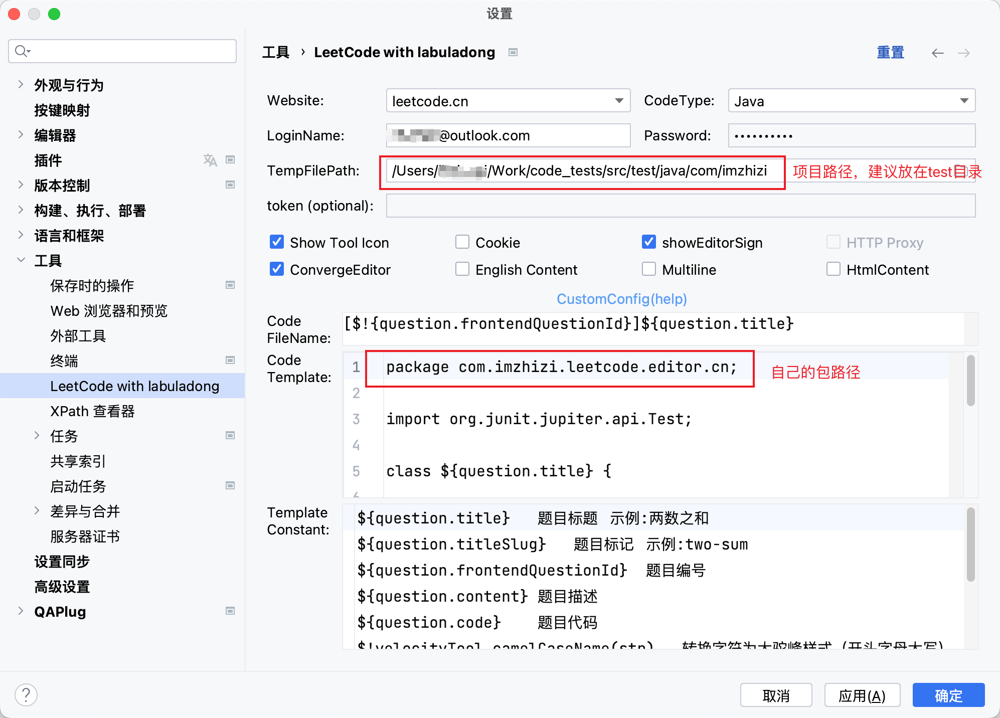

## Good Luck

### 1. 安装
插件地址 [LeetCode with labuladong - IntelliJ IDEs Plugin | Marketplace](https://plugins.jetbrains.com/plugin/19317-leetcode-with-labuladong)


### 2. 基本配置
安装后侧边栏会多一个按钮，登录之类的功能自己参考说明，正常人都能看懂。


### 3. 推荐配置
一览




完整配置

**注意事项**
- 路径自行修改
- 放了一个@Test注解便于本地执行调试
- 需要POM中自行引入Junit5，Junit需要改依赖路径

```
package com.imzhizi.leetcode.editor.cn;

import org.junit.jupiter.api.Test;

class ${question.title} {

${question.code}

    @Test
    public void test() {

    }

}

```

依赖
```xml
    <dependency>
        <groupId>org.junit.jupiter</groupId>
        <artifactId>junit-jupiter</artifactId>
        <version>5.9.1</version>
        <scope>test</scope>
    </dependency>
```